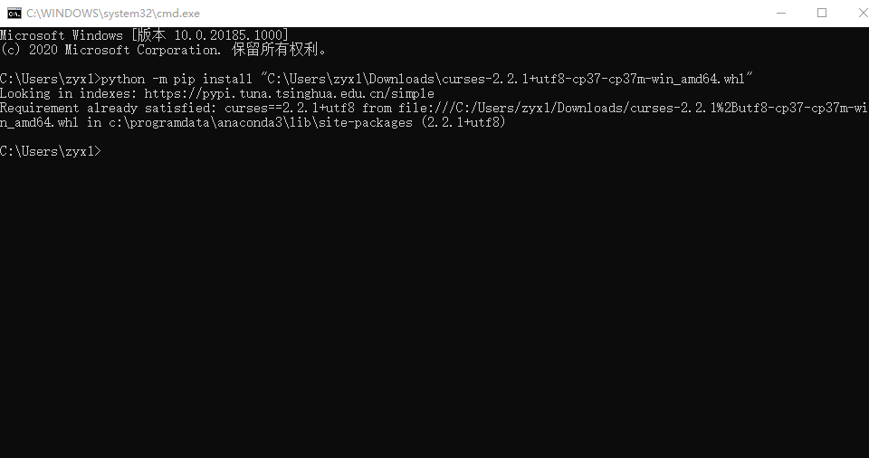
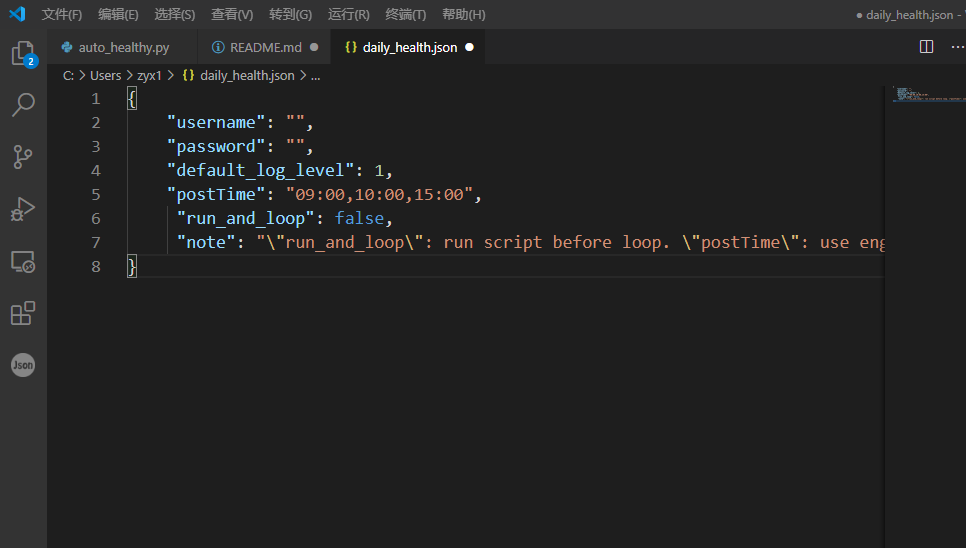
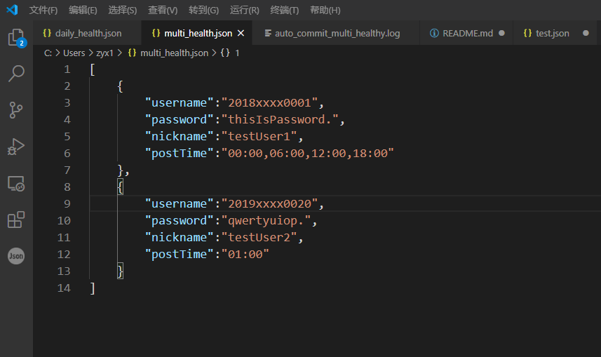
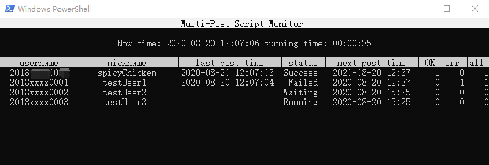

# daily_health_script

### 介绍
NUIST健康日报填写脚本

**注意**: 脚本运行可能会造成时间不准确(误差一分钟是有可能的)

### 版本信息

~~(由于我太菜了导致我版本号是乱起的)~~

### 运行

**必备工具**

**测试环境**: python 3.7.6

**建议的环境**: python 3.6.0+

**包列表**:

PackageName         | version   | Type  | Note
:---:               | :---:     | :--:  | :---:
my-fake-useragent   | 0.1.6     | 可选  | 如果实在装不上可以不用, 后面有讲
beautifulsoup4      | 4.8.2     | 必备  | 安装的名称是"beautifulsoup4", 包名是bs4
requests            | 2.22.0    | 必备  | 网络请求用的包, 一般都能装上
js2py               | 0.70      | 必备  | 因为需要执行js脚本来计算密码, 所以是必需的

包的安装方式: `python -m pip install <PackageName>`

**运行方法**

**必备工具**
- python3
- requests (python的包)
- my-fake-useragent (python的包)

包的安装方式: `python -m pip install requests my-fake-useragent`

**运行方法**

- 第一次运行, 输入`python auto_healthy.py loop` 或者 `python auto_healthy.py once`来生成配置文件.
    - 配置文件在上述帮助信息中会说明位置.
    - 配置文件的扩展名是json
    - 另一个log结尾的是日志文件
- 打开配置文件(上述为C:\\Users\\zyx1\\daily_health.json)

    - `username`: [学校网站](http://my.nuist.edu.cn)的用户名
    - `password`: 学校网站的密码
    - `default_log_level`: 默认的日志等级: 0-5对应`debug`, `info`, `warn`, `error`, `fatal`和`disable`. 默认的是1(info)
    - `postTime`: 发送请求的时间, 可以是单个时间, 可以是逗号隔开的时间, 格式是HH:MM, 注意逗号和冒号是英文符号, 中间没有空格. (loop模式)
    - `run_and_loop`: 在设定循环提交之前先提交一次请求. (loop模式)
    - `note`: 就是note信息嘛... 这个不影响的2333...
    - 配置好的json文件大概长成这个样子:

- 配置文件配置好, **保存**, 然后再运行刚才的`python auto_healthy.py loop` 或 `python auto_healthy.py once`, 就可以正常运行了(前提是账号密码啥的没问题)

#### 提醒

有些设备可能没办法安装`my-fake-useragent`模块, duck不必担心.

py文件里面, 有一行是`from my_fake_useragent import UserAgent as UA`, 删掉, 后面有一行`self.s.headers['User-Agent'] = UA().random()`改成你想换的`User-Agent`就可以了.

比如
 `self.s.headers['User-Agent'] = "Mozilla/5.0 (Windows NT 10.0; Win64; x64) AppleWebKit/537.36 (KHTML, like Gecko) Chrome/84.0.4147.105 Safari/537.36"`

## **如果代码有问题的话, 可以把最后出问题的log文件截图[发给我](mailto:happy.rabbit.yy@outlook.com)**

#### 注意

**此版本增加了重试次数. 如果窗口显示Success表示成功了**

当日志里面提示超时(Timed Out)的时候, 如果3次重试全部都是超时, 建议自己用电脑/手机/平板等, [访问](http://my.nuist.edu.cn)一下并且尝试打开网页版健康日报. 如果网页版访问正常, 且多次请求全部超时, 请[联系我](mailto:happy.rabbit.yy@outlook.com).

~~不过很有可能我也不知道这东西应该怎么处理... (对不起, 我太菜了)~~

设置超时的原因, 是因为怕长时间无响应导致程序卡死.
默认设置的超时是15秒(

一些可能较为常见的错误信息:
 
- **ConnectionTimedOut**: 连接超时, 此版本增加了重试次数. 如果窗口显示Success表示成功了
- **ReadTimeout**: 发送请求15秒后服务器没有回应, 读取超时. 
- **KeyError**: 可能是配置文件有问题, 请检查配置文件或重新生成配置文件.
- **PermissionError**: 权限不足, 一般不会出现这个问题, 如果确实出现了... 请尝试用管理员权限执行.

**最后, 开发者不建议使用脚本来填写, ~~我只是太懒了所以才写的~~**