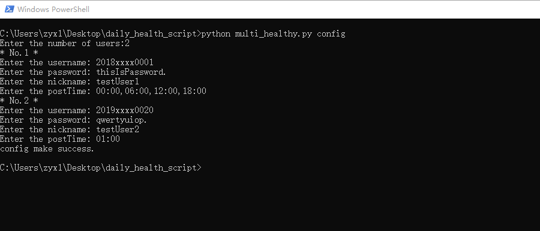

### 多用户版健康日报填报脚本

NUIST 健康日报填报脚本(多用户版)

**注意**: 多用户版的脚本可能不是很稳定, 而且时间也不一定会按照设定好的时间走(有可能误差1分钟). 而且开发者不建议多用户版超过64个用户一起登录(可能窗口太长看不到信息了2333).

### 版本信息

~~(由于我太菜了导致我版本号是乱起的)~~

**注意**: 一般情况下, `multiver`分支的版本信息会和`master`分支下的版本信息相同 ~~(其实也就是复制粘贴而已啦哈哈哈哈)~~

### 运行

**必备工具**

**测试环境**: python 3.7.6

**建议的环境**: python 3.6.0+

**包列表**:

PackageName         | version   | Type  | Note
:---:               | :---:     | :--:  | :---:
my-fake-useragent   | 0.1.6     | 可选  | 如果实在装不上可以不用, 后面有讲
beautifulsoup4      | 4.8.2     | 必备  | 安装的名称是"beautifulsoup4", 包名是bs4
requests            | 2.22.0    | 必备  | 网络请求用的包, 一般都能装上
js2py               | 0.70      | 必备  | 因为需要执行js脚本来计算密码, 所以是必需的
curses              | 2.2.1+utf8|必备   | 多用户显示, 如果不让使用curses, 那我只能禁用了(XD)

包的安装方式: `python -m pip install <PackageName>`

### 运行

**必备工具**

- python3
- requests(python的包)
- my-fake-useragent(python的包)
- curses(python的包)
    - [Windows版安装教程](https://www.cnblogs.com/hardcoreYutian/p/11270871.html)
    - [下载地址](https://www.lfd.uci.edu/~gohlke/pythonlibs/#curses)
    - 注意, 没有这个包, 本脚本无法正常工作, 望知悉.
    - 安装: `python -m pip install <whl文件路径>`
    - 例如:

    - 安装完成后尝试执行`python -c "import curses"`, 如果没有错误等, 证明安装成功. (大概成功了吧...)
    - (备份了一份放在了[curses](./curses)文件夹里)

### 目前的功能

- [x] 多用户提交
- [x] 生成配置文件的脚本和运行的脚本合二为一
- [x] 配置文件读取并添加用户
- [ ] ~~配置文件修改和删除用户(**暂不可用**)~~
- [x] 多用户同界面显示
- [x] 隐藏光标显示
- [x] 运行时长和当前时间一同显示
- [x] 显示下次提交时间
- [x] 用户备注(昵称, 只允许ASCII字符, 20字符以内)
- [x] 失败后自动重试(单次运行自动重试4次, 4次失败自动推迟30分钟)

文件所在位置:
- [x] log文件在用户目录下的pyLogs里的auto_commit_multi_healthy.log
- [x] 配置文件在用户目录下的multi_health.json
### 使用方法

**注意**: 由于加载项较多, 导致脚本初始化较慢(1-5秒左右), 请耐心等待.

#### 生成配置文件

输入命令`python multi_healthy.py config`来生成配置文件

例如: 

生成后的配置文件为:

如果想要修改和删除用户信息... 只能自己修改配置文件了... ~~(对不起我太懒了orz)~~

#### 启动程序

输入`python multi_healthy.py loop`来运行程序

运行后, 输入命令的光标消失, 界面改变, 注意不要擅自改变窗口大小, 尤其是缩小窗口, 很容易导致程序崩溃(因为我太菜了, 刚开始使用python的curses库, 不是很会用...)

运行结果大致如下:

菜单栏:
- **username**: 学号
- **nickname**: 用户设定的昵称, 方便区分用户
- **last post time**: 上次的提交时间
- **status**: 状态
    - *Waiting*: 等待中且没有上次提交结果.
    - *Running*: 运行中
    - *Success*: 提交成功.
    - *Failed*: 提交失败, 详情请查看log文件.
- **next post time**: 下一次的运行时间.
- **OK**: 提交成功次数
- **err**: 提交失败次数
- **all**: 提交总次数

#### 备注

**关于`my-fake-useragent`不能安装的问题**:

如果有些设备无法安装`my-fake-useragent`, 可以将脚本里的`from my_fake_useragent import UserAgent as UA`删掉, 把`self.s.headers['User-Agent'] = UA().random()`修改成`self.s.headers['User-Agent'] = "Mozilla/5.0 (Windows NT 10.0; Win64; x64) AppleWebKit/537.36 (KHTML, like Gecko) Chrome/84.0.4147.105 Safari/537.36"`

后面的这个User-Agent可以修改成你想改的.

**关于`curses`无法安装的问题**:

如果有些设备没办法安装`curses`, 建议自己去找一下安装教程, 或者... 使用单用户版的吧(

**开发者并不建议使用脚本, 最好还是自己去填. ~~只是我太懒了所以才写的脚本...~~**